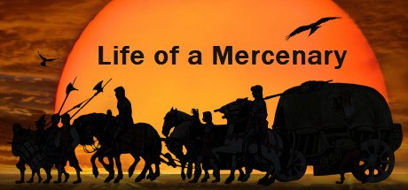

# _LIFE OF A MERC_    

 "Everything can be taken from a person, but one thing: the last of human freedoms - to choose one's attitude in any given set of circumstances, to choose one's own way."

### Introduction:
This story takes place in the Kingdom of Magincia. You are a mercenary captain with a small castle on the southern edge of the central province. You along with your two companions have decided to setup this mercenary company. 
That begs the question, what exactly is your mercenary company called? 
1. White Ravens
2. Bloody Axes
(1: White Ravens) (2: Bloody Axes)
You arrive at your keep alongside your companions, Arlo and Anne. Arlo is a spearman and a former member of the royal guard. Anne is a freelance fighter and a skilled duelist with the sword. You met them during your early days as a Fellow Mercenary.

### Background Story on why you opened the company in the first place:
(Arlo and Anne happened to be in the same mercenary company as you. The mercenary captain was rather inexperienced and led his company right into an enemy trap. A bloody battle happened in which you three were among the dozen or so that survived. After that day you all vowed to never fight under anyone else's mercenary flag unless it was your own)

As a mercenary you have been in many battles and hostile situations. Have you suffered many wounds?
1. A medium number of scars, but that is common in my line of work
2. A lot of scars, and few close calls but I’m still here
(1: A medium number of scars, but that is common in my line of work) (2: A lot of scars, and few close calls but I’m still here) 
Arlo and Anne have had some epic disagreements over the year and often use you as the impartial tie breaker. Due to this many clients started referring to you as a captain since you seemed to make all the decisions for the group. Arlo and Anne did not mind, as long as they were getting paid. Over the years, they have even grown to respect your leadership.

After you saved enough money to purchase land and build a small castle with a decent keep, you realized you had to hire staff as well, you hired an advisor named Redford, and older fighter past his prime, and Stanton, a very efficient quartermaster. You also employed a healer, guards, and other servants.

You, Arlo and Anne were all sitting in the castle's main chamber discussing possible mercenary work.
Anne was first to speak, "Ok, so we spent all this gold and now we have an official mercenary company, I think it is about time we took a new mission. How about we head north? I hear there is plenty of work there."

Arlo laughs, " To the barren and rocky North? Sure, there is plenty of work there, but also plenty opportunities to lose your head in the process. Barbarians constantly raid there and the majority of people we would be working for would be cutthroats."
Anne smiles, "Sounds like my kind of place. I’m tired of escorting lords on trade missions."
Arlo hisses, "Those are decent paying jobs with a low amount of risk."
Anne smirks, "That is exactly what I am talking about, Low risk, Low reward. I say we look for better paying jobs! What do you say?”
1. Agree with Anne
2. Agree with Arlo
(1: Agree with Anne)
Anne nods, "See even the captain agrees we should start doing real mercenary work."
Arlo simply shakes his head.
You start taking care of everything, preparing to head north.
Arlo approaches you concerned about the risk we are about to take, “Are you sure about this captain. We are just 3 mercenaries, heading north right now would be suicide.”
You put your hands on his shoulders and say:
    1. “You don’t have to worry; we’ll be extra careful”.
    2. “Man up! Since when we are afraid of a little challenge”.
(1: “You don’t have to worry; we’ll be extra careful”.) (2: “Man up! Since when we are afraid of a little challenge”.)
Arlo nods and continue packing.
On the road you encounter a tree in the middle of the road, looks like it was newly cut. 
You feel that some bandits did it to set a trap. You stop your chariot and look around… you don’t see anyone but you find a side road that will let you avoid the tree but takes at least 2 days:
    1. Continue forward
    2. Take the side road
(1: Continue Forward)	
When you got close to the tree you notice someone hiding behind it, you quickly turn your chariot around trying to avoid the trap but they shoot your horses with arrows and you can’t move anymore. You look in the tree direction to find that the bandits started to reveal themselves.
They were 8 bandits but look unexperienced except for one which you assume to be their leader.
You approach him:
1.  Negotiate giving them money and leave
2.  Attack their leader 
(1: Negotiate giving them money and leave)
As soon as you open your mouth to try negotiating, he pulls his sword and aim it right on your neck. Arlo and Anne got furious of what’s happening and they attack the leader immediately. They managed to hit him from the waist, but before hitting him he slit your throat. 
You can’t breathe any more knowing that you’re about to die you gather all the force left in your body just to open your eyes. When you do, you see Anne and Arlo both heavily injured, on their knees and about to die…   				GAME OVER.
(2:  Attack their leader)
As soon as you got close to him you pulled your sword and slashed his head off without giving anyone a chance to react. The bandits are shocked by what just happened some of them scared. You, Arlo and Anne immediately engage them because you felt that their moral went down to 0. As you run at them most of them ran away but only 2 stayed, they surrendered and asked to join your mercenary team
1. Kill them
2. Accept them in your team
(1: Kill them)
You continue your way north until you reach a village so you and your team decide to rest here for a day. You find a place to stay and stock up on food and minerals. Anne had a bad feeling about this village so she wanted to explore around just to make herself feel better but Arlo said “let’s just take this day off and rest in bed so we can continue our journey tomorrow”
1. take the day off
2. wander around with Anne
(1: take the day off)
You decide to rest for the day. While you’re sleeping the village gets raided by a huge army of bandits, burning the whole village and leaving no survivors. You tried to escape with Arlo and Anne but they caught you off guard and killed you. 		GAME OVER.
(2: wander around with Anne)
Before going out, you want to take a weapon just in case. But since it was just exploring you were unsure of what to take:
1. Take your sword.
2. Take a small knife and hide it in your pocket
You start exploring the village with Anne. While wandering around, Anne spots 2 guards rushing in a house, both of you get near the house to eavesdrop. You hear them saying something about a raid happening today and that there was a spy in the village giving information to some group of bandits. You go back to let Arlo know about the situation and that you have to leave. On the way back, you spot a bar. Anne grabs your hand and drags you in there saying, “Common captain have some fun once in a while”
After about 3 rounds of drinking you start feeling a bit dizzy 
(1: Take your sword)
Some drunk guys start harassing Anne, there were 3 of them. You quickly go and push one of them back. They see that you have a sword on your waist so they back off immediately.
Time passed by quickly, before you know it the sun was rising. While returning to your place to rest you hear shouting and screaming you look around and see a huge army invading this land. Too tired to run, the invading army catches up to you and kills you. 		GAME OVER
(2:  Take a small knife and hide it in your pocket)
Some drunk guys start harassing Anne, there were 3 of them. You quickly go and push one of them back. The other 2 pulls out a knife and start stabbing you. Anne tries to help you but she’s too drunk to fight so she also gets stabbed. The three men kidnap Anne while you’re laying on the ground barely able to move… time passes and no one is approaching, this village is known by its cruelness towards outsiders. You die from bleeding. 		GAME OVER

(2: Accept them in your team)
Anne quickly run towards you and take you to the side, “Captain, are you sure about this? We don’t know a single thing about them and just a second ago they were ready to kill us”

1.	Yeah, you’re right, we shouldn’t take them.
2.	It’s fine we’ll keep a close eye on them.
(1: Yeah, you’re right, we shouldn’t take them)
Back to: “(you continue your way north…)”
(2: It’s fine we’ll keep a close eye on them.)
You walk for hours and now Arlo, Anne and you want to rest so you set a camp to sleep and decide to take turns watching the new recruits. While Arlo was watching them, he fell asleep for a moment, the bandits take advantage of that moment and stabs Arlo while covering his mouth for the noise. They approach your tent and burn it, you and Anne quickly got out not knowing what’s happening and still tried from the road. Both of you couldn’t react well to the situation, they attack you and slit both your throats.				GAME OVER

(2: Take the side road) 
After about a day of travelling you reach a small village. The people in there seems friendly and welcoming, you find a place to stay and rest. The next day you wake up and ready to leave, while leaving you notice a poster on a tree next to the village saying, “WANTED Vera queen of the north DEAD (1 million coin)”.
Anne immediately takes the poster, “We have a specific target now” she says. Arlo was a bit worried but seeing that they are already in the north he went along with Anne so you decide to take the mission. 
You start going from a village to another asking about her whereabout until you reach an old man with scars all over his face. He warns you about the danger you’re about to take and tells you where you can find her.
Without a second thought you go to the castle he told you about, it’s heavily guarded. You see a huge door that leads you straight into the main chamber, and a sewer next to you. Remembering how your castle was built the sewer can also lead to the main chamber but you never know what you might find inside.
1.	Head straight to the door
2.	Risk taking the sewer path
(1: Head straight to the door)
As soon as you approach the door you get shot by a cloud of arrows. You couldn’t escape that kind of attack. 			GAME OVER.
(2: Risk taking the sewer path)
You start moving into the sewers, Anne is disgusted by the smell but you force her to continue silently anyway. Until you reach a place where you can enter the main chamber. You peek before opening the sewers, a girl that looks exactly like Vera in the poster is sitting on the chair and a guy on his knees in front of her giving her information about a situation.
1.	Wait a bit and see what happens
2.	Enter the main chamber and engage her
(1: Wait a bit and see what happens)
Vera stands and start walking heading out of the room, she moves next to the sewer entrance. You take the opportunity and bash through the sewer entrance and without hesitation you cut her head off her body, you see 4 guards in the room but they were in shock of what just happened so you immediately attack them and take control of the main chamber. Vera’s army surrenders to you after hearing what happened and you become known as (name) The ruler of the north. 		THE END
(2: Enter the main chamber and engage her)
You open the sewers and get into the room. Vera looks at you surprised, “how did you get in here! Guards, capture them!” you put up a fight with the guards, after Vera feeling that the guards can’t catch you, she orders them to kill and she joins the fight. As soon as she did the moral of the guards skyrocketed. You couldn’t handle the pressure and the numbers coming towards you, you die by the hands of Vera. But before killing you she looks at you, “Who sent you here?” she asks, you look at her and explain that you saw the poster near a small village. After you tell her she immediately kills you and orders the guards to fortify the castle with everything they got. She now knows that someone is out to get her.  			GAME OVER

(2: Agree with Arlo) 

"You see the captain understands this is the best way to grow our company.", replies Arlo and gives Anne a smug smile. Anne mutters something about knocking his teeth out.

As the three of you were sitting quietly in the castle’s main chamber, Redford comes in with some paper in his hands. He approaches and gives you the papers, you take a look at them to realize that they are some mercenary contracts.
After reviewing the current mercenary jobs, Arlo and Anne wait to hear what you will suggest:
    1. Your target is Vera known as the queen of the north (1 million coin)
    2. Help the lord collect taxes from the nearby villages (100,000 coin)
(1: Your target is Vera known as the queen of the north (1 million coin))
--same as 1: Agree with Anne—
(2: Help the lord collect taxes from the nearby villages (100,000 coin))
You, Arlo and Anne move from village to another collecting taxes for the lord.
For your successful work, the lord awards you with an extra 50,000 coin.
Mission after mission in the Kingdom of Mgincia, your wealth slowly gets bigger. Anne is not satisfied with these small missions and rewards here and there; she wants more challenging work with large profit. So, she decides to leave your mercenary company to take her own mercenary road.

You and Arlo stay in your castle accepting missions in the kingdom.

END.

